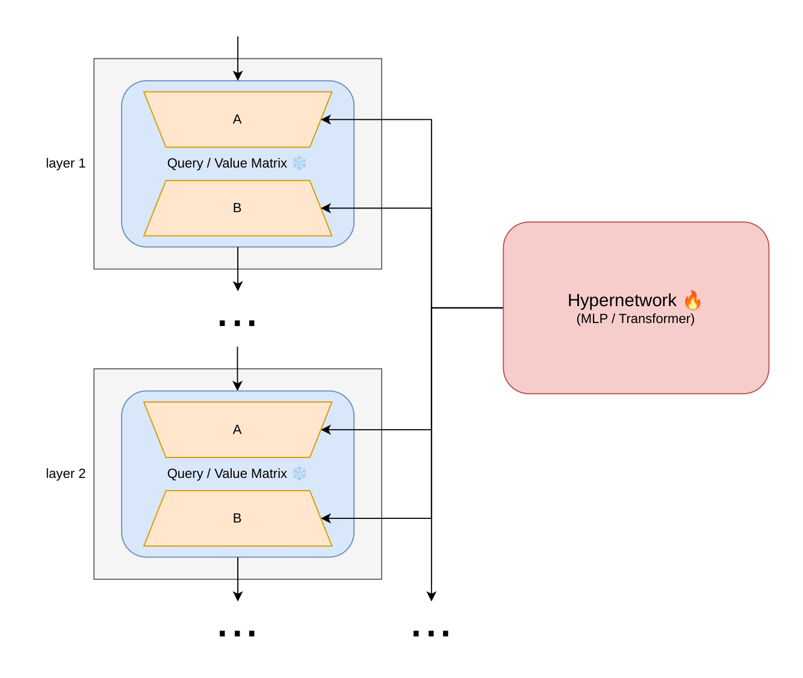

# HypeLoRA: Hypernetwork-Generated LoRA Adapters for Calibrated Language Model Fine-Tuning

> **Bartosz Trojan & Filip Gębala** — Upper-Secondary Schools of Communications in Cracow


  

## Abstract

Modern Transformer-based models frequently suffer from miscalibration, producing overconfident predictions that do not reflect true empirical frequencies. This work investigates the calibration dynamics of LoRA (Low-Rank Adaptation) and a novel hypernetwork-based adaptation framework as parameter-efficient alternatives to full fine-tuning for RoBERTa. Evaluating across the GLUE benchmark, we demonstrate that LoRA-based adaptation consistently achieves calibration parity with — and in specific tasks exceeds — full fine-tuning, while maintaining significantly higher parameter efficiency. We further explore a dynamic approach where a shared hypernetwork generates LoRA factors (A and B) to induce structural coupling across layers. Our results reveal a critical trade-off: constraining the adaptation space (e.g., freezing matrix A) acts as a powerful regularizer that enhances ECE, but necessitates a carefully balanced sacrifice in downstream task accuracy.

---

## Overview

Standard LoRA adapters are static — once trained, each layer uses a fixed pair of low-rank matrices **A** and **B**. This project replaces the per-layer static **B** matrix (and optionally **A**) with the output of a compact shared **hypernetwork** (`LoRAHyperNet`). The hypernetwork conditions on a learned embedding for each transformer layer and generates coordinated adapter weights across all layers in a single forward pass, while all backbone parameters remain frozen.

### Key ideas

- **Dynamic weight generation** — adapter weights are produced on every forward pass by the hypernetwork, enabling parameter sharing across layers and reducing total adapter parameter count.
- **Two hypernetwork architectures** — a 4-layer MLP (hidden size 2048, GELU) or a 2-layer Transformer encoder (256-dim, 16 heads), both conditioning on 128-dim learned layer embeddings.
- **Fixed-A vs. generated-A variants** — matrix A can be frozen (Kaiming uniform init) while only B is generated, which acts as a regularizer improving calibration at some cost to task performance.
- **Noise blending** — generated matrices can be mixed with the initial random matrices via `add` / `multiply` / `replace` modes; the blending coefficient `noise_alpha` is linearly annealed to 0 during training.
- **Calibration-aware evaluation** — every evaluation step computes ECE, Classwise-ECE, MCE, ACE, Thresholded ACE, and Brier Score alongside the GLUE task metric.

---

## Key Findings

1. **LoRA ≈ Full Fine-Tuning in calibration** — LoRA provides calibration comparable to full fine-tuning across most GLUE tasks while being significantly more parameter-efficient.

2. **Hypernetwork does not universally improve calibration** — fully generating both A and B via the hypernetwork yields metrics broadly similar to standard LoRA, suggesting that structural coupling across layers alone does not produce systematic confidence correction.

3. **Fixing matrix A regularizes the model** — freezing A while generating only B introduces a structured perturbation that modestly lowers ECE. The trade-off is a consistent drop in task performance (MCC on CoLA, accuracy on SST-2).

4. **Extended training degrades calibration** — across all methods, longer training progressively overfits the distribution and erodes uncertainty estimates.

---

## Project Structure

```
.
├── run_experiment.py               # Main training entry point
├── calibration_metrics.py          # ECE, CECE, MCE, ACE, TACE, Brier Score
├── requirements.txt
│
├── models/
│   ├── hypernet.py                 # LoRAHyperNet (MLP) & LoRAHyperNetTransformer
│   ├── dynamic_lora_layer.py       # DynamicLoRALayer – applies hypernet output as LoRA
│   └── get_roberta.py              # Model builders (baseline & hypernet variants)
│
├── data_loading/
│   └── get_datasets.py             # GLUE dataset loading & tokenization
│
├── utils/
│   ├── alpha_callback.py           # Linearly anneals noise_alpha during training
│   ├── batch_generation_trainer.py # Custom Trainer: pre-generates B matrices per batch
│   ├── forward_pass_repetition_data_collator.py  # Gradient accumulation via repeated passes
│   ├── lr_scheduler_callback.py    # LR schedule utilities
│   ├── metrics.py                  # B-matrix statistics (mean / std across layers)
│   ├── metrics_trainer_callback.py # Saves per-epoch metrics to CSV
│   └── one_hot_encoding.py         # One-hot encoder (alternative to learned embeddings)
│
├── params/
│   ├── example_config_hypernet.py  # Template config — hypernet mode
│   ├── example_config_no_hypernet.py # Template config — LoRA / FT baseline
│   ├── ft_baselines/               # Full fine-tuning configs per GLUE task
│   ├── lora_baselines/             # LoRA baseline configs per GLUE task
│   ├── hypernet_mlp/               # MLP hypernet experiments (fixed_A / gen_A)
│   ├── transformer/                # Transformer hypernet experiments
│   └── roberta_large_baselines/    # RoBERTa-large FT & LoRA configs
│
├── pretrained_models/              # Saved checkpoints
└── results/                        # CSV metric logs per run
```

---

## Installation

```bash
python -m venv venv
# Windows
venv\Scripts\activate
# Linux / macOS
source venv/bin/activate

pip install -r requirements.txt
```

**Requirements:** Python ≥ 3.9, PyTorch, Transformers, PEFT, Datasets, WandB, scikit-learn, accelerate.

---

## Running Experiments

All experiments are driven by a single entry point that takes a Python config file:

```bash
python run_experiment.py --params <path/to/config.py>
```

The script loads the dataset, builds the model, runs `num_runs` independent seeds, logs to **WandB**, and saves metrics to `results/`.

### Baselines

```bash
# Full fine-tuning
python run_experiment.py --params params/ft_baselines/cola.py

# LoRA baseline
python run_experiment.py --params params/lora_baselines/cola.py
```

### Hypernetwork experiments

```bash
# MLP hypernet, fixed A matrix
python run_experiment.py --params params/hypernet_mlp/fixed_A/cola.py

# MLP hypernet, generated A matrix
python run_experiment.py --params params/hypernet_mlp/gen_A/cola.py

# Transformer hypernet
python run_experiment.py --params params/transformer/fixed_A/cola.py
```

---

## Configuration Reference

Config files are plain Python dicts assigned to a `params` variable. Key parameters:

| Parameter | Description |
|---|---|
| `glue_dataset_name` | GLUE task: `cola`, `sst2`, `mrpc`, `qqp`, `mnli`, `qnli`, `rte`, `stsb` |
| `model_name` | HuggingFace model ID or local checkpoint path |
| `use_hypernet` | `True` to use dynamic LoRA via hypernetwork; `False` for baseline |
| `use_peft` | Wrap model with PEFT LoRA config |
| `lora_r` | LoRA rank (default: 8) |
| `lora_alpha` | LoRA scaling factor |
| `layers_to_transform` | Encoder layers to apply LoRA to (default: all 12) |
| `layers_to_use_hypernet` | Subset of layers whose LoRA weights are generated by the hypernet |
| `hypernet_use_transformer` | `True` for Transformer hypernet; `False` for MLP |
| `hypernet_transformer_nhead` | Number of attention heads (Transformer hypernet) |
| `hypernet_transformer_num_layers` | Number of Transformer layers in hypernet |
| `hypernet_hidden_dim` | Hidden dimension of the MLP hypernet |
| `hypernet_embeddings_dim` | Dimension of the learned layer embedding (default: 128) |
| `hypernet_A_matrix` | How matrix A is handled: `"random"`, `"fixed"`, or `"generated"` |
| `hypernet_noise_type_A/B` | Blending mode for A/B: `"replace"`, `"add"`, `"multiply"` |
| `hypernet_noise_alpha` | Initial blending weight; annealed to 0 when `hypernet_reduce_noise_alpha=True` |
| `hypernet_large_model` | `True` for 4-layer MLP; `False` for 2-layer |
| `hypernet_use_batches` | Pre-generate B matrices once per batch |
| `forward_pass_reps` | Repeat forward pass N times per batch |
| `num_runs` | Number of independent runs (different seeds) |

---

## Calibration Metrics

After each evaluation step the following metrics are computed and logged to WandB and the results CSV:

| Metric | Formula / Description |
|---|---|
| **ECE** | Weighted mean of per-bin \|accuracy − confidence\| gaps |
| **Classwise ECE (CECE)** | ECE computed per class, averaged over all classes |
| **MCE** | Maximum per-bin calibration error (worst-case bin) |
| **ACE** | ECE with equal-population bins, averaged per class |
| **TACE** | ACE restricted to predictions above a confidence threshold ε ∈ {0.01, 0.001, 0.0001} |
| **Brier Score** | Mean squared error between predicted probability vector and one-hot label |

---

## Experiment Tracking

All runs are logged to [Weights & Biases](https://wandb.ai). Each run is tagged with:
- `hypernet` or `baseline`
- GLUE dataset name
- Run index

Metrics are also saved locally as CSV files in `results/` for offline analysis.

---

## Supported GLUE Tasks

| Task | Metric |
|---|---|
| CoLA | Matthews Correlation (MCC) |
| SST-2 | Accuracy |
| MRPC | F1 |
| QQP | F1 / Accuracy |
| MNLI | Accuracy |
| QNLI | Accuracy |
| RTE | Accuracy |
| STS-B | Pearson / Spearman correlation |

---

## Citation

If you use this code, please cite:

```bibtex
@inproceedings{trojan2026hypelora,
  title     = {HypeLoRA: Hypernetwork-Generated LoRA Adapters for Calibrated Language Model Fine-Tuning},
  author    = {Trojan, Bartosz and Gębala, Filip},
  booktitle = {Proceedings of LNCS},
  year      = {2026}
}
```

## Acknowledgements

The authors thank Dr. Kamil Książek, Dr. Tomasz Kuśmierczyk, and Prof. Jacek Tabor of the Jagiellonian University for their guidance and support throughout this work.

---